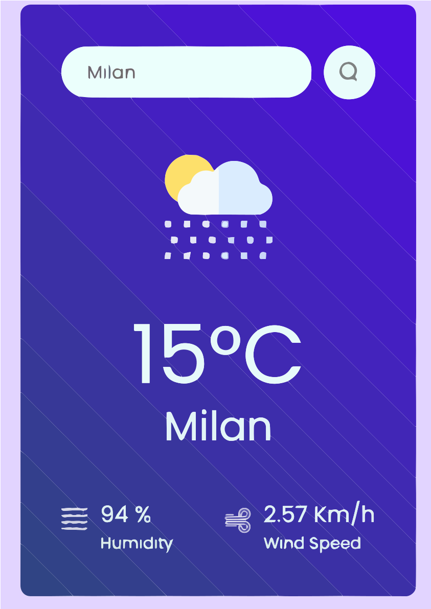

# React + Vite Weather App cretaed by Sapumal Perera

THe Weather app is created using React with Vite template. it gets its weather data from openweather API and display current weather details including Humidity and wind speed. the user has the ability to search for a city of user's choice to see whats the current weather of the city.

To run locally download the files and run command line `npm run dev` in the terminal. 

Screen shot of the running webb app is as below

